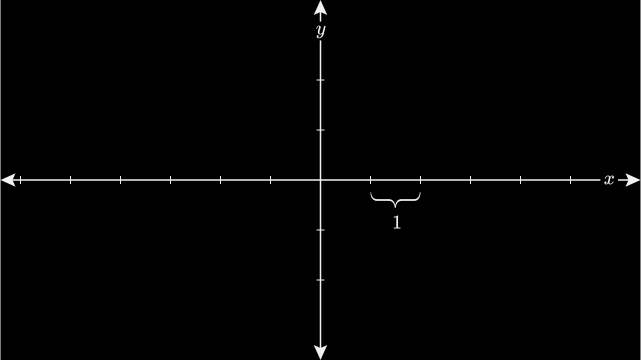
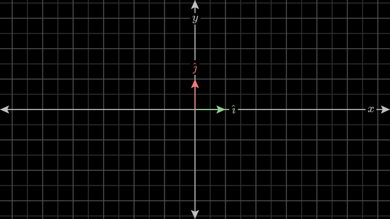
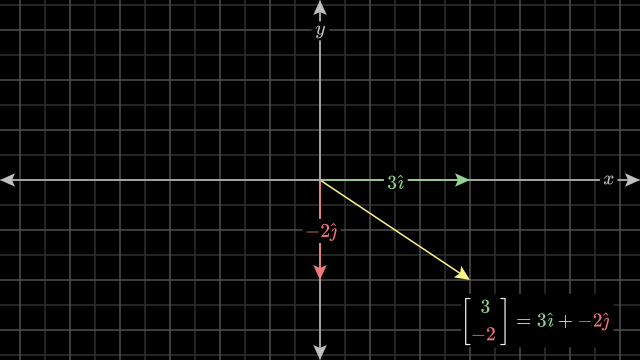
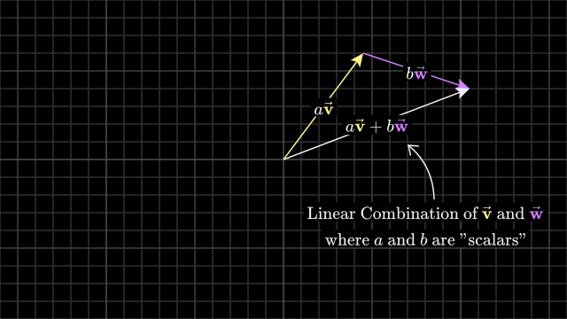
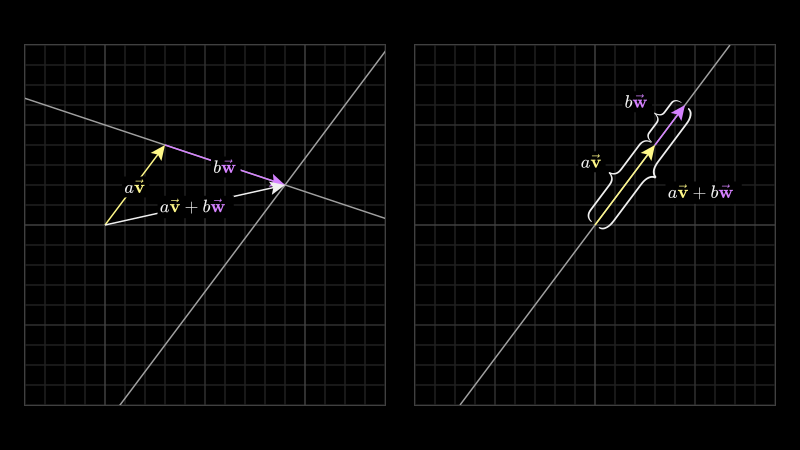
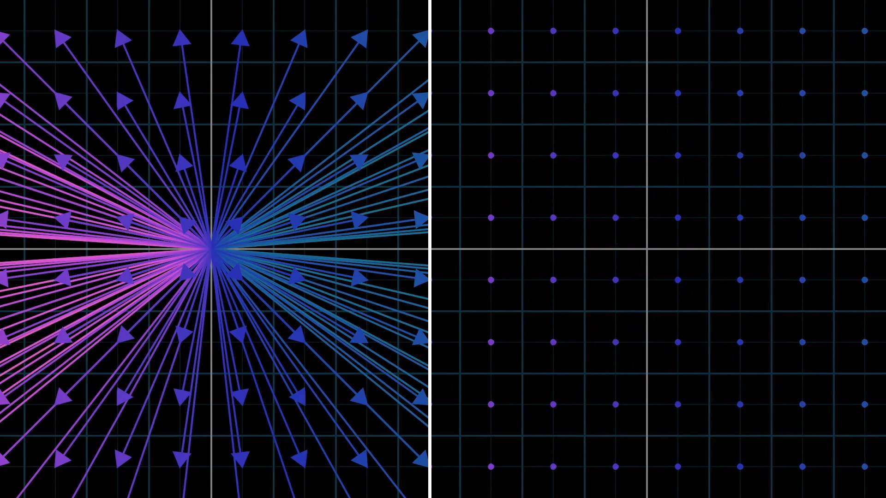
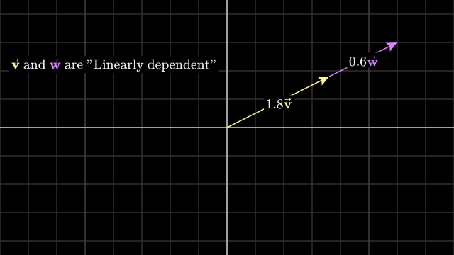
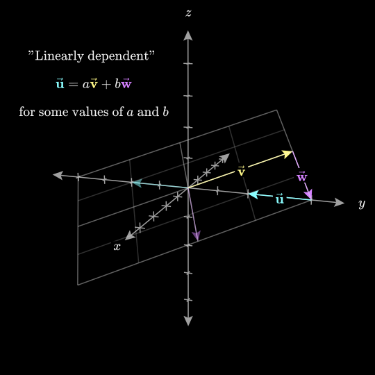

+++
title = "Linear Algebra: 1"
date = "2025-10-14"
author = "Hashan Fernando"
description = "Let's dive into basics!"
categories = ["IMPROVEMENTS"]
tags = ["Math"]
math = true
toc = true  # Table of contents (requires config below)
image = 'card-img.jpg'
hideNav = false

+++

## Linear Algebra 

I think, most of us those who studied know when to use linear algebra, and when to use matrices and vectors. But do we actually understand what happening underneath the hood?

Recently, I started to write. Mainly because my writing is bad, and I am having an sense of urgency to improve it. While doing this, I started to understand the value of writing. This is my take on linear algebra basics,  not all but things that required. If you want a high level picture, I highly recommend 3Blue1Brown’s [Essence of Linear Algebra series](https://youtube.com/playlist?list=PLZHQObOWTQDPD3MizzM2xVFitgF8hE_ab&si=RRPEX1vV0uRBu6ch). 

When we learn linear algebra for the first time, we might not grasp the intuitive concept clearly. This is because there are a lot of definitions and unfamiliar symbols, and we surely know how to use them, but we don't know the reason behind them. We should study the linear algebra backwards, usually we learn linear algebra this way:

1. **Vectors and matrices**
2. **How to use vectors/matrices:** matrix–vector products, matrix multiplication, determinants, etc.
3. **More use cases:** projections, various kinds of decompositions
4. **Null spaces, bases, dimensions, kernels, etc.**
5. **Eigenvalues and eigenvectors**
6. **Finally, we talk about *linear transformations*!**

This way of learning is not going to give us intuitive  understanding. Linear transformations helps us to understand the math behind vectors, matrices and vector- matrix product and all. Knowing how to play with these concepts are important, but it is more important to understand the concepts rather than trying to remember it. We will start to learn in this order:

1. **Linearity and linear transformations**
2. **Concepts of a basis, vector, and matrix**
3. **Matrix multiplication, eigenvalues, and eigenvectors**
4. **Rest of linear algebra**

I am not sure how long it will take me to cover this, but I am going to do it. In this post, I am only going to discuss up-to matrix multiplications.

## Linearity

**Linear algebra is the study of linear transformations!** A function is linear if it has these properties:

- **Homogeneity (scaling):** $$f(ax) = af(x)$$ 
- **Additivity:** $$ f(x_1 + x_2) = f(x_1) + f(x_2)$$

In words: Scaling the input by a scales the output by a. Adding two input produces same output as applying each input individually and adding the two separate outputs. 

If we have two related physical properties, for example the speed you can run and the distance you can run. If you double your speed, you will double your distance. If you triple your speed, you triple your distance. This is called a *linear* relationship. The term *linearity* refers to the property of *scaling*. 

The term "linear" in everyday use describes something resembling a line ( Latin word *linearis* is “made of lines”).. Also, in high school mathematics, the word linear is used to describe a straight line (Geometry, a line), $y = ax+b$. This use of the term linear is not what we are talking about here. A function like this does not satisfy above properties. So the difference is that in linear algebra, *linear* refers to transformations that pass through the origin and preserve the structure of vector addition and scaling, not just to shapes that look like straight lines.

What do I mean by  “passing through the origin”? In linear algebra, the **origin** corresponds to the **zero vector**. A *linear transformation* T must satisfy:

$$
T(0) = 0
$$

This comes directly from the scaling property:

$$
T(cx) = cT(x)
$$

If you set `c=0`, you get `T(0)=0`.

In linear transformations, transformation must send the origin to the origin. Mathematically, any map that doesn’t send zero to zero breaks the linear rule. Also, linear transformations are supposed to stretch, rotate, or flip vectors, **but never shift them somewhere else!**

## Why linear transformations, change of basis is important?

Answering this would get us into the heart of the linear algebra. Linear transformations are everywhere because they are the building blocks of complex transformations. In linear transformations, change of basis means we are changing the coordinate system that "fits: the problem structure. Then the interpretation becomes easier. Let's take couple of examples that use linear transformations:

- Physics and engineering
- Signal processing and Fourier transform
- Robotics and navigation
- Statistics (regression)
- Machine learning
- Data science (PCA — Principal Component Analysis)
- Computer graphics

Since we are focusing on AI/ML let's dive into use cases of them. Computer games that we are playing requires computer graphics. In computer graphics, the whole rendering pipeline is metrics/vector multiplication. In here linear transformations are used to rotate objects, resize objects, flatten objects. Also in computer vision, every photo is a matrix of pixel values. when we rotate,flip, or resize images for data augmentations, we are applying linear transformations. Also, an important problem in the field of computer vision is "Edge detection". This uses linear transformations and calculus. In the edge detection, linear transformation transforms images into new representation where edges are highlighted.

We use PCA for dimensionality reduction (I will explain this in a separate blog). PCA finds new coordinate system that best explains the variation in the data. It doesn't change the data, it changes our perspective. 

Neural networks are set of transformation chains! Each layer in neural network is a linear transformation (Wx), followed by an activation function. Each layer's weight matrix ($W^l$) learns how to define a new coordinate system. So that it easier for the network to separate outcomes! That means loss is low! Crazy right?

You can find more examples with math here (https://understandinglinearalgebra.org/sec-bases.html)

## What is Linear combinations, span, and basis vectors?

Basis is singular, bases is plural. Read about [vectors here](https://www.3blue1brown.com/lessons/vectors).

## How to think about coordinate systems?

To main perspectives of linear algebra happens in coordinate systems. Therefore it is important to have a solid understanding. If we focus on two dimensions, you have a horizontal line (x-axis), and a vertical line (y-axis). The place where they intersect called the origin. Think it as center of the space. After choosing **arbitrary** length to represent length of 1, you make tick marks on each axis spaced out by this distance,
- Coordinates of a vector are a pair of numbers that give instructions on how to get from the tail of the vector (at the origin) to its tip.
- It is conventional to write this pair of numbers vertically, using square brackets, to distinguish vectors from points.

## Standard coordinate system

When we say *standard (or xy) coordinate system* in $\mathbb{R}^2$, we mean:

- There is a horizontal axis \(x\) and a vertical axis \(y\).
- The two axes intersect at the origin \((0, 0)\).
- Every point in the plane (think of it like a sheet of paper) can be described by how far you move along the \(x\)-axis and the \(y\)-axis.
- All of the above are common to many coordinate systems, but what makes this the **standard coordinate system** is **the choice of basis**, and the fact that the axes are perpendicular.

  - A unit vector in the \(x\)-direction:

  $$
  \hat{i} = \begin{bmatrix}
  1 \\
  0
  \end{bmatrix}
  $$

  - A unit vector in the \(y\)-direction:

  $$
  \hat{j} = \begin{bmatrix}
    0 \\
    1
  \end{bmatrix}
  $$

  - [Notations and best practice](https://www.underleaf.ai/learn/latex/vectors)

x coordinates scales $\hat{i} $, and y coordinates scales $\hat{j} $. A vector of these coordinate describes a sum of two scaled  vectors. If we choose a different basis vectors, we get completely different coordinate system. Anytime we describe vectors numerically, it depends on an implicit choice of what basis vectors are we choosing.

## Basis

In xy coordinate system there are two special vectors:  $\hat{i},  \hat{j}$. A unit vector on x direction(right), and a unit vector on y direction(up). Let's take a vector $ \begin{bmatrix} 3 \\ -2 \end{bmatrix}$.

Now think x coordinates as a scalar that scales $\hat{i}$, stretching it by a factor 3, and y coordinates as a scalar that scales $\hat{j}$, flipping and stretching by a factor 2. The concept of adding together two scaled vectors is important. Those two vector $\hat{i} , \hat{j}$ together they are called the "basis" of the coordinate system. When we think coordinates as scalars, the basis vectors are what those actually scale.

% So finally, Do using these two ij you can define any vector in that space!!!!

## Linear combinations

Any time you are scaling two vectors and adding them like this is called "linear combination" of those two vectors.

Where does the word "linear" come from here? What does this have to do with lines? When you multiply scalar by a vector, it changes the magnitude of that vector. If you multiply every possible real number by the vector, you will get an infinite line that passes through the origin and the point defined by the vector.

So, linear combination of two vectors is a method of combining these two lines. For most pairs of vectors, if you let both scalars range freely and consider every possible vector you could get, you will be able to reach every possible point on the plane. Every two-dimensional vector is within your grasp.

However, if your two original vectors happen to line up, the lines produced by the scalar multiplication will be the same line, so adding them together can't yield a vector outside of that line.

## Span

The set of all possible vectors you can reach with linear combinations of a given pair of vectors is called the "span" of those two vectors. The span of most pairs of 2D vectors is all vectors in 2D space, but when they line up, their span is all  vectors whose tip cit on a certain line.

## Vectors and points

People commonly think vectors as points(not as a arrow drawing from the origin). It becomes difficult to think about whole collection of vectors all at once.

So how do you supposed to think about vectors? In general, if you're thinking of a vector on its own, think of it as an arrow, and if you're thinking of a collection, it's convenient to think of them as points.

## Linearly dependent

When you have multiple vectors, can remove them without reducing the span (if linearly dependent)
One of the vectors can be expressed as linear combination of others .since it is already in the span of the others.

$$
w = a v 
$$

$$
z = a v + b w
$$

## Linearly independent

On the other hand, if each vector really does add another dimension to the span, they are said to be “linearly independent”.

$$
w \neq a v 
$$

$$
z \neq a v + b w
$$

**The technical definition for the “basis” of a space is a set of linearly independent vectors that span that space.**

